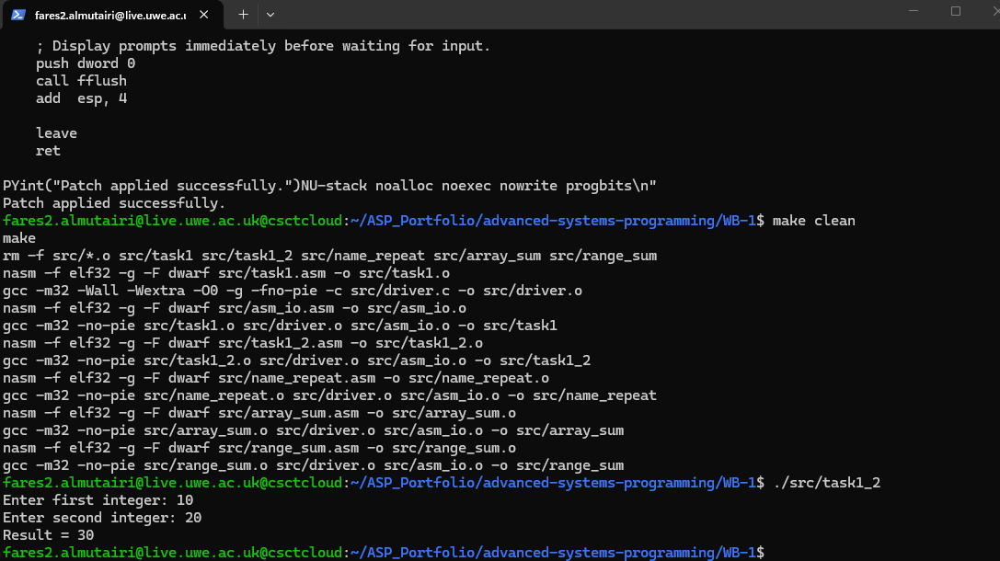
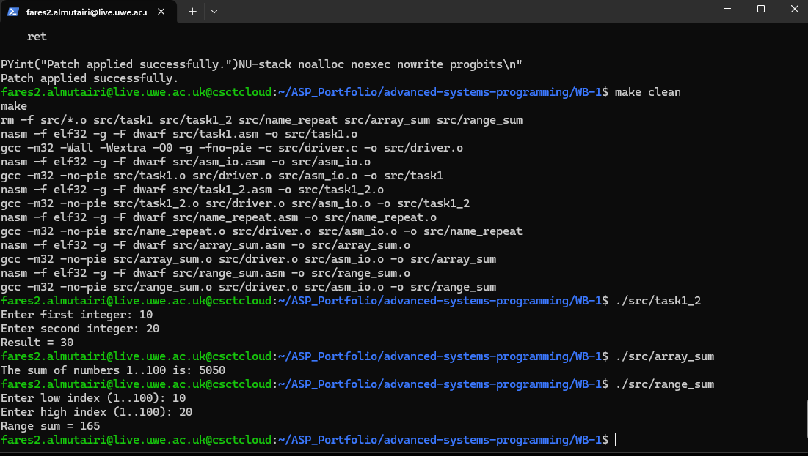
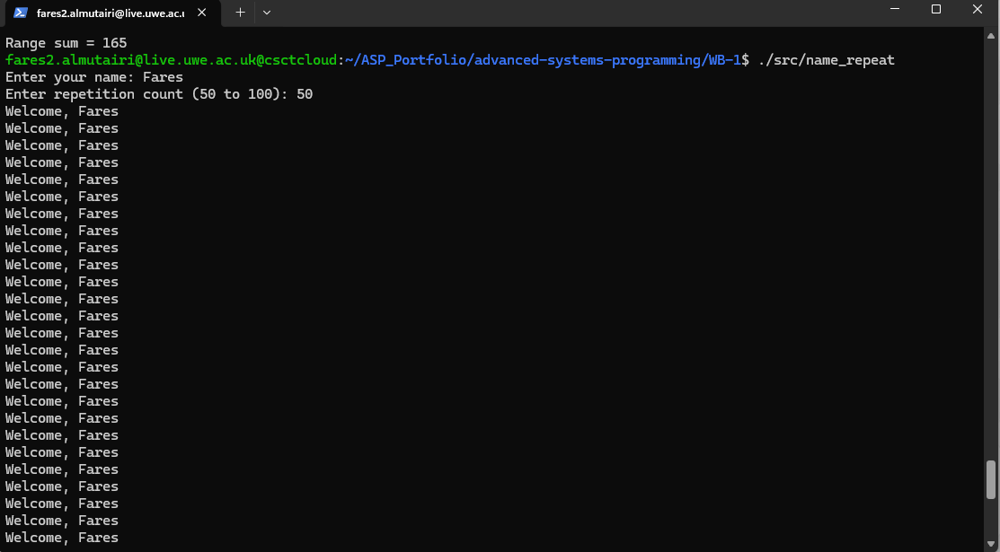
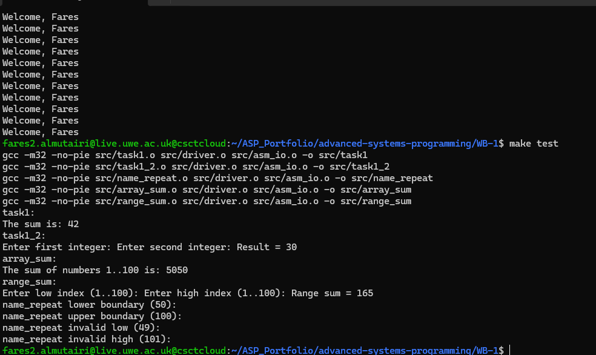

# Worksheet 1 — An Echo of Assembler

**Student:** Fares Almutairi  
**Student ID:** 23072137  
**Module:** Advanced Systems Programming (`UFCFWK-15-2`)  
**Date:** 4 December 2025

## Overview

This repository contains the five 32-bit x86 assembly programs required for
Worksheet 1. The programs are assembled with NASM and linked with a small C
driver and the included `asm_io` implementation. The work was built and tested
on `csctcloud.uwe.ac.uk`.

## Repository structure

```text
.
├── README.md
├── Makefile
├── .gitignore
├── evidence/
└── src/
    ├── asm_io.asm
    ├── asm_io.inc
    ├── driver.c
    ├── task1.asm
    ├── task1_2.asm
    ├── name_repeat.asm
    ├── array_sum.asm
    └── range_sum.asm
```

## Task implementation

| Program | Implementation | Expected result |
|---|---|---|
| `task1.asm` | Adds two global integers, 13 and 29 | `The sum is: 42` |
| `task1_2.asm` | Reads two integers and prints their sum | `10 + 20 = 30` |
| `name_repeat.asm` | Reads a name and validates `50 <= n <= 100` | Prints exactly `n` greetings |
| `array_sum.asm` | Creates and sums the array `1..100` | `5050` |
| `range_sum.asm` | Validates and sums an inclusive index range | Indices `10..20` give `165` |

The assembly routines preserve the required callee-saved registers. Input
bounds are checked before array access. Output is explicitly flushed before
input is requested so prompts display correctly over SSH.

## Build and run

Requirements: NASM, GCC, GNU Make and 32-bit development libraries.

```bash
make clean
make
```

Run the programs individually:

```bash
./src/task1
./src/task1_2
./src/name_repeat
./src/array_sum
./src/range_sum
```

Run the repeatable test suite:

```bash
make test
```

Remove generated files before committing:

```bash
make clean
```

## Testing summary

| Test | Input | Observed result | Status |
|---|---|---|---|
| Global sum | None | `42` | Pass |
| Interactive sum | `10`, `20` | `30` | Pass |
| Lower repetition boundary | `Fares`, `50` | 50 greetings | Pass |
| Upper repetition boundary | `Fares`, `100` | 100 greetings | Pass |
| Invalid low boundary | `Fares`, `49` | Rejected | Pass |
| Invalid high boundary | `Fares`, `101` | Rejected | Pass |
| Array sum | None | `5050` | Pass |
| Inclusive range sum | `10`, `20` | `165` | Pass |

## Evidence

### Clean build and interactive addition



### Array and range results



### Valid name repetition



### Automated tests



## Reflection

The main technical challenge was maintaining the 32-bit cdecl calling
convention while calling C library functions from assembly. Loop counters and
array bounds must not be accidentally overwritten by function calls, so the
programs preserve `EBX`, `ESI` and `EDI` where required. A clean build and the
boundary tests demonstrate that the repository does not depend on stale object
files and that invalid inputs are rejected before memory is accessed.

## Submission details

- **Repository URL:** Add after creating the GitHub/GitLab repository.
- **Demonstration video URL:** Add after uploading the required face-and-screen recording.
- **Collaboration and tool declaration:** Complete truthfully in accordance with the module's academic-conduct requirements before submission.

## References

- Carter, P.A. (2019) *PC Assembly Language*.
- Advanced Systems Programming lecture and worksheet material.
